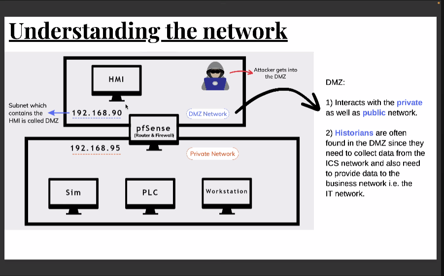
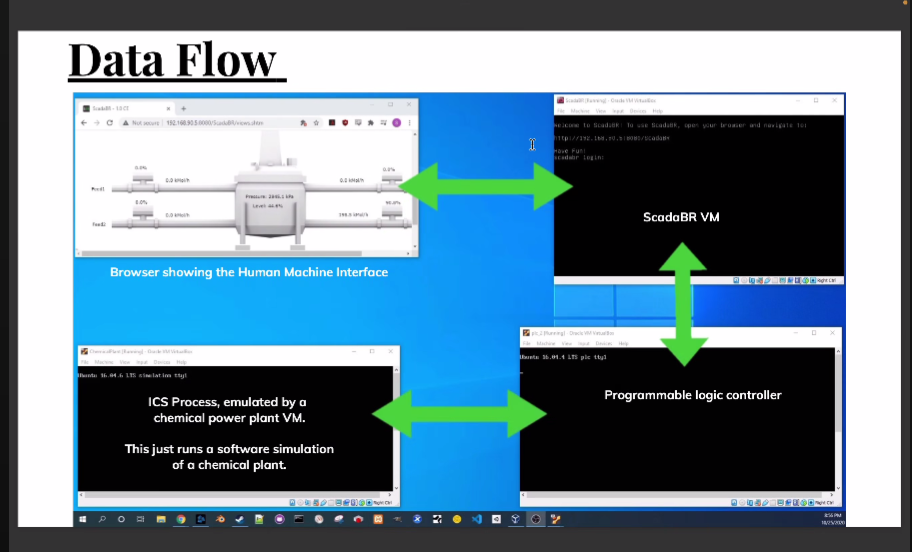

## OT

important protocols netioned :
modbus 
mqtt
profbus
OPC UA

concepts:
closed loop control system

app.plcsimulator.online
https://app.plcsimulator.online/D01SGpy9xvMCfU5J7sQw

openplc editor

learning ladder logic
https://www.youtube.com/watch?v=zsajTNtxfAE

## Demo for OT

There will be an HMI
DMZ specific

Historian
https://claroty.com/team82/research/hacking-ics-historians-the-pivot-point-from-it-to-ot

historian is the database

we need to create a malicious ladder logic/ program that will crash the system

from HMI we need to interact with PLC at right interface

Modbus master and modbus slave

Master device sends data to modbus slave

how to create modbus programme?
https://pymodbus.readthedocs.io/en/latest/

OT_wordlist/demo-wordlist-OT.txt

https://github.com/shifa123/OT-Wordlist

ffuf -u http://192.168.90.5:8080/FUZZ -w demo-wordlists-OT -c -maxtime 60 -mc 200,301,302

openplc server will be there where you have to change the ladder logic

95.2 is the modbus master

modbus command bus

attacker will have to spoof

spoof the mac to send the traffic

arpspoof HMI ip address

to change values use msfconsole

